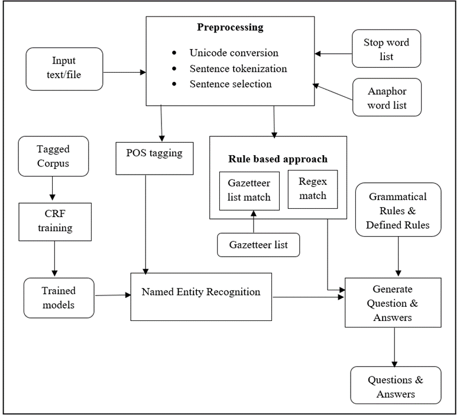

# Domain Specific Question & Answer generation in Tamil

![project] ![research]

- <b>Project Mentor</b>
    1. Dr Uthayasanker Thayasivam
- <b>Contributor</b>
    1. Rubika Murugathas

---

## Summary

A web based Question & Answer generation system in Tamil language for history domain using various NLP techniques including
a Named Entity Recognition(NER) built using machine learning techniques to support Tamil language with data trained on history 
documents. The system is intended to help the students studying in Tamil medium to learn more efficiently and evaluate themselves 
for history subject. It also benefits the examiners in preparing quizzes and exam papers using the system.  

The system accepts text or file related to history domain in Tamil language as input from user and processes the text 
sentence by sentence and generate possible factoid WH questions with answers and output them in text or downloadable text 
file format.

## Description

The system has 4 components: 
- Preprocessing module
- Rule based module
- Named Entity Recognition module 
- Question and Answer generation module 

#### Preprocessing Module
- Read file content - Read content in text/pdf file
- Unicode conversion - Convert different Tamil encodings to Unicode.
- Text Cleaning - Removing HTML tags, extra white spaces, special characters, etc
- Tokenization - Split text paragraphs into list of meaningful sentences
- Sentence selection - Sentence with anaphora words at the beginning are ignored.

#### Rule-based Module
- Regex pattern matching - Regex pattern defined to generate ‘When’ and ‘How many’ type of questions.
- Gazetteer match - A gazetteer list for few named entities are defined

#### NER Module
- Approach : Machine Learning 
- Classifier : Conditional Random Field (CRF)
- Algorithm : lbfgs CRF (Limited-memory Broyden-Fletcher-Goldfarb-Shanno) 
- Library : Sklearn-crfsuite
- Dataset 
  - Corpus : 23k tokens 
  - Data tag set : 38 tag types
  - Data Source : Grade 10 & 11 History textbook(Sri Lankan Syllabus)
  - Annotation Schema : IOB2
  - Format : CONLL
- Feature suitable for domain and languages selected for NER tagging.  
- HyperTuning applied due to the unbalanced dataset.
  - algorithm : RandomizedSearchCV

#### QAG Module
- Approach : Rule based
- Identified named entities from Rule-based and NER module is replaced with question word
- Affix stripping algorithm implemented to find the inflection suffix.

### Technologies Used
- Programming language - Python
- Web framework - Flask

### Libraries Used
- Flask
- Flask Bootstrap
- PYPDF2
- OpenTamil
- Scipy
- Sklearn-crfsuite
- Sklearn  
- SnowballStemmer
- RippleTagger
- IndicNLP
- Pickle

---

### License

Apache License 2.0

### Code of Conduct

Please read our [code of conduct document here](https://github.com/aaivu/aaivu-introduction/blob/master/docs/code_of_conduct.md).

[project]: https://img.shields.io/badge/-Project-blue
[research]: https://img.shields.io/badge/-Research-yellowgreen
